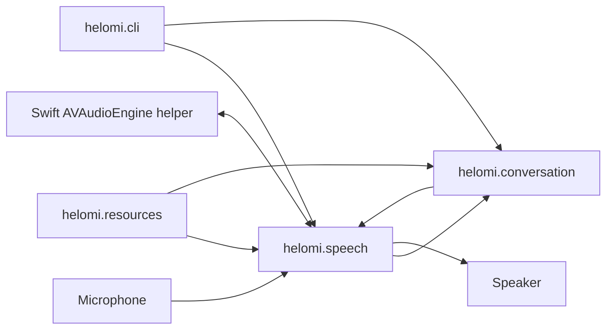

# Helomi

[](https://www.python.org/)
[](https://support.apple.com/guide/mac-help/about-this-mac-system-information-mchlp1171/mac)
[](LICENSE)

**A local, privacy-first voice assistant for Apple Silicon Macs.**

Helomi listens for a local wake word, transcribes speech, generates a streamed
reply, synthesizes it, and plays it back. The supplied configuration uses local
MLX models and a native macOS audio helper with Apple Voice Processing.

## What it does

- Runs a full voice turn locally: wake word, VAD, segmentation, STT, response,
  phrase streaming, TTS, and playback.
- Supports multiple local assistant profiles with their own prompts, wake word,
  model parameters, and voice configuration.
- Uses Apple Voice Processing in the default `avfaudio` driver to support
  full-duplex playback and interruption. `pyaudio` is a fallback, not an
  equivalent echo-cancellation implementation.
- Keeps settings, profiles, downloaded assets, recordings, and benchmark output
  in a local Helomi data directory.

## Requirements

- macOS on Apple Silicon.
- Python 3.14 and [uv](https://docs.astral.sh/uv/).
- Xcode command-line tools and Swift for the native audio helper.
- Microphone permission for a real voice session, network access for the first
  model installation, and sufficient memory for the selected local models.

## Quick start

From a checkout:

```bash
make init
make run-cli
```

`make init` synchronizes Python dependencies, builds the native audio helper,
installs missing local configuration, and downloads the models required by the
default Alexa profile. It may take time and download several gigabytes.

Use `HELOMI_HOME` to install or run against another data directory:

```bash
HELOMI_HOME=/path/to/helomi-data make init
HELOMI_HOME=/path/to/helomi-data make run-cli
```

At startup, select a valid profile. Say its configured wake-word label, speak
after activation, and interrupt an answer by speaking while it is playing.

## Privacy and limits

The supplied setup is local-first. Models may be downloaded from Hugging Face,
and switching the conversation adapter to a remote or networked endpoint changes
that privacy boundary. Voice recordings can be biometric data and must not be
committed or shared without informed consent.

Helomi is an early local system. Real microphone, device routing, Voice
Processing, Metal inference, model quality, and voice quality require validation
on the target Mac; automated tests do not prove those properties.

## Architecture



The terminal application composes the runtime; the speech and conversation
workers communicate through typed events. See the [architecture overview](docs/architecture/overview.md)
for the data flow and lifecycle.

## Documentation

- [Getting started](docs/getting-started.md)
- [Using Helomi](docs/usage.md)
- [Configuration](docs/configuration.md)
- [Creating a profile](docs/profiles.md)
- [Troubleshooting](docs/troubleshooting.md)
- [All documentation](docs/README.md)
- [Contributing](CONTRIBUTING.md)

## Development

Run the complete repository gate before submitting cross-package work:

```bash
make verify
```

See [CONTRIBUTING.md](CONTRIBUTING.md) for focused checks, hardware validation,
and documentation/ADR policy.

## License

Helomi source code is available under the [MIT License](LICENSE).

Dependencies and models are separate works and retain their own licenses. In particular, voices, wake-word assets, and
individual Hugging Face models may impose attribution, redistribution, or usage conditions. Review the relevant model
card or download source before redistribution or commercial use.
