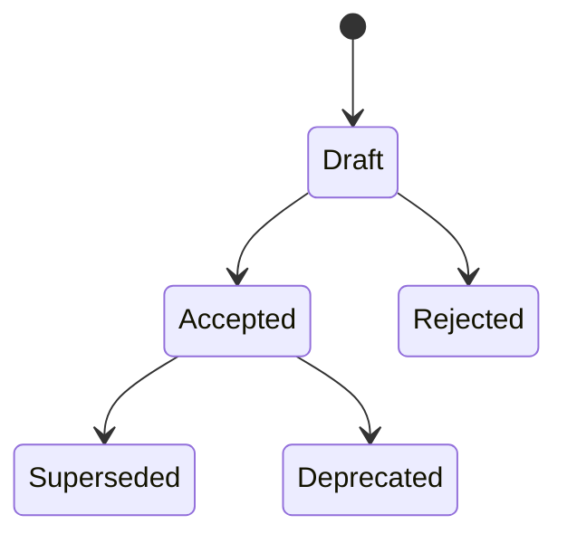

# Architecture decision records

ADRs preserve durable architectural decisions and their consequences. They do
not replace source inspection, configuration reference documentation, issues,
or benchmark reports.

## Lifecycle

- **Draft**: under discussion and editable.
- **Accepted**: approved and applicable.
- **Rejected**: considered and declined; explain the reason and what new
  evidence could justify reconsideration.
- **Superseded by ADR-NNNN**: replaced by a newer decision.
- **Deprecated**: no longer applicable without a direct replacement.

Assign the next number when a draft is created. Numbers and filenames are never
reused, and records remain in this flat directory as status changes. This keeps
links stable and preserves Git history. Do not use `Done`: implementation status
belongs in linked issues or pull requests.

Accepted ADRs are immutable apart from status and supersession metadata. Change
a decision through a new ADR that links to the earlier record.

Use an ADR for durable changes to package ownership, configuration contracts,
cross-worker concurrency, native protocol compatibility, privacy boundaries,
persistence, or core technology selection. Do not create one for routine code
details or recurring benchmark measurements.

## Index

### Accepted

| ADR | Title | Date |
| --- | --- | --- |
| [0002](0002-event-driven-worker-lifecycle.md) | Event-driven worker lifecycle | 2026-08-03 |
| [0003](0003-local-settings-and-profile-contract.md) | Local settings and profile contract | 2026-08-03 |
| [0004](0004-native-full-duplex-audio-helper.md) | Native full-duplex audio helper | 2026-08-03 |
| [0005](0005-lazy-local-model-adapters.md) | Lazy local model adapters | 2026-08-03 |
| [0007](0007-reusable-application-runtime-boundary.md) | Reusable application runtime boundary | 2026-08-03 |

### Draft

| ADR | Title | Date |
| --- | --- | --- |
| [0006](0006-natural-voice-conversation-policy.md) | Natural voice conversation policy | 2026-08-03 |
| [0008](0008-python-menu-bar-desktop-frontend.md) | Python menu-bar desktop frontend | 2026-08-03 |

### Rejected

No records.

### Superseded or deprecated

| ADR | Title | Date | Status |
| --- | --- | --- | --- |
| [0001](0001-package-ownership-and-composition.md) | Package ownership and composition | 2026-08-03 | Superseded by ADR-0007 |
