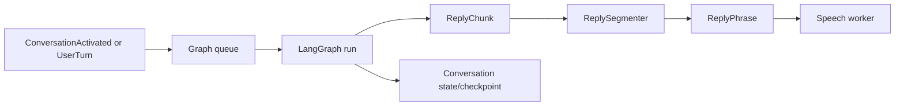

# Conversation

The conversation worker owns finite graph execution, history, profile
preparation, local language-model loading, and safe phrase segmentation. It does
not own microphone capture, playback, or voice-session policy.

One graph run is active at a time. The worker assigns reply identifiers,
publishes generation lifecycle events, and streams non-empty model chunks. The
segmenter emits speakable phrases while retaining an incomplete draft for the
terminal UI.

When speech detects barge-in, `CancelReply` cancels the active task, drains
queued inputs, and records the actually delivered prefix as context for the next
run. This prevents the assistant from assuming that unplayed text was heard.

Language-model runtimes are acquired lazily during profile preparation. MLX is
the supplied local adapter; LangChain is an alternative for an
Ollama-compatible endpoint. Configuration and profile-role rules are documented
in [Configuration](../configuration.md).
