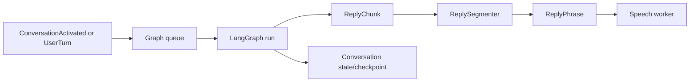

# Conversation

The conversation worker owns finite graph execution, history, profile
preparation, local language-model loading, and safe phrase segmentation. It does
not own microphone capture, playback, or voice-session policy.

One visible graph run is active at a time. The worker assigns reply identifiers,
publishes generation lifecycle events, and streams non-empty model chunks. The
segmenter emits speakable phrases while retaining an incomplete draft for the
terminal UI. After a completed user reply, summarization is a separate idle
maintenance run. A new activation, user turn, interruption, or shutdown cancels
maintenance before starting further model work.

Each selected profile owns a local SQLite memory database. Its LangGraph
checkpointer restores the profile's one stable conversation thread after restart;
after each successful idle summary, the graph retains only the configured recent
messages and compacts superseded checkpoints. A separate keyed-fact table accepts
only explicit remember/list/forget tool requests. SQLite FTS5 retrieves up to five
facts relevant to the current user turn and supplies them as system context; no
automatic fact extraction runs.

`TurnPlanner` first handles empty input, exact cancellation phrases, explicit
response requests, explicit detailed requests, and standalone questions locally,
including common punctuation-free Polish forms produced by transcription. It sends
only ambiguous acknowledgements, corrections, follow-ups, and underspecified turns
to the local classifier. The classifier may choose no response, one clarification
question, or brief, standard, or detailed response depth; invalid output falls back
to a standard response and cannot cancel a turn.

MLX caches the stable profile system-prompt prefix. Per-turn summary, delivery
context, and response-depth instructions remain outside that cache, so changing
conversation state does not discard the expensive persona prefix. A bounded cache
falls back to full prompt generation for chat templates that cannot represent a
safe prefix.

For explicit standard and detailed requests, the graph waits up to the configured
acknowledgement delay for its first model chunk, then emits one prepared
acknowledgement when needed. Other standard and detailed turns use the longer
wait-reaction delay and its neutral wait pool. Brief responses, silence, and
cancellation remain silent; a turn emits at most one prepared reaction. Reactions
are not persisted in conversation history, and speech playback adds the configured
pause before the answer continues.

When a model selects a tool, the conversation graph routes the request through
the tool service. Immediate results return to the model in the same finite run.
Background tools enqueue one in-memory job, emit a prepared background
reaction, and later re-enter the graph as a result input. MCP sessions,
subprocesses, filesystem watching, and job execution remain outside graph state;
only the conversational result is checkpointed.
Completed background summaries use protected delivery: Helomi waits for the
current reply to finish and does not let barge-in interrupt the summary.

Model adapters normalize provider-specific reasoning and tool-call syntax before
it reaches the graph. Explicit file and durable-memory requests require a valid
tool call: Helomi buffers the candidate response, retries one malformed response
with a strict instruction, and never exposes protocol markers or accepts prose
as evidence that a side effect succeeded. MLX uses its tokenizer-native parser
for model families such as Gemma; LangChain uses provider-native tool calls.

When speech detects barge-in, `CancelReply` cancels the active task, drains
queued inputs, and records the actually delivered prefix as context for the next
run. The reply ID prevents a stale cancellation from affecting newer generation.
This prevents the assistant from assuming that unplayed text was heard.

Language-model runtimes are acquired lazily during profile preparation. MLX is
the supplied local adapter; LangChain is an alternative for an
Ollama-compatible endpoint. Configuration and profile-role rules are documented
in [Configuration](../configuration.md).
