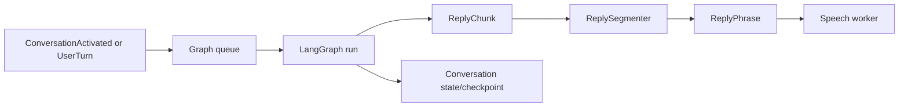

# Conversation

The conversation worker owns finite graph execution, history, profile
preparation, local language-model loading, and safe phrase segmentation. It does
not own microphone capture, playback, or voice-session policy.

One visible graph run is active at a time. The worker assigns reply identifiers,
publishes generation lifecycle events, and streams non-empty model chunks. The
segmenter emits speakable phrases while retaining an incomplete draft for the
terminal UI. After a completed user reply, summarization is a separate idle
maintenance run. A new activation, user turn, interruption, or shutdown cancels
maintenance before starting further model work.

`TurnPlanner` first handles empty input, exact cancellation phrases, explicit
detailed requests, and standalone questions locally. It sends only ambiguous
acknowledgements, corrections, follow-ups, and underspecified turns to the local
classifier. The classifier may choose no response, one clarification question,
or brief, standard, or detailed response depth; invalid output falls back to a
standard response and cannot cancel a turn.

When speech detects barge-in, `CancelReply` cancels the active task, drains
queued inputs, and records the actually delivered prefix as context for the next
run. The reply ID prevents a stale cancellation from affecting newer generation.
This prevents the assistant from assuming that unplayed text was heard.

Language-model runtimes are acquired lazily during profile preparation. MLX is
the supplied local adapter; LangChain is an alternative for an
Ollama-compatible endpoint. Configuration and profile-role rules are documented
in [Configuration](../configuration.md).
