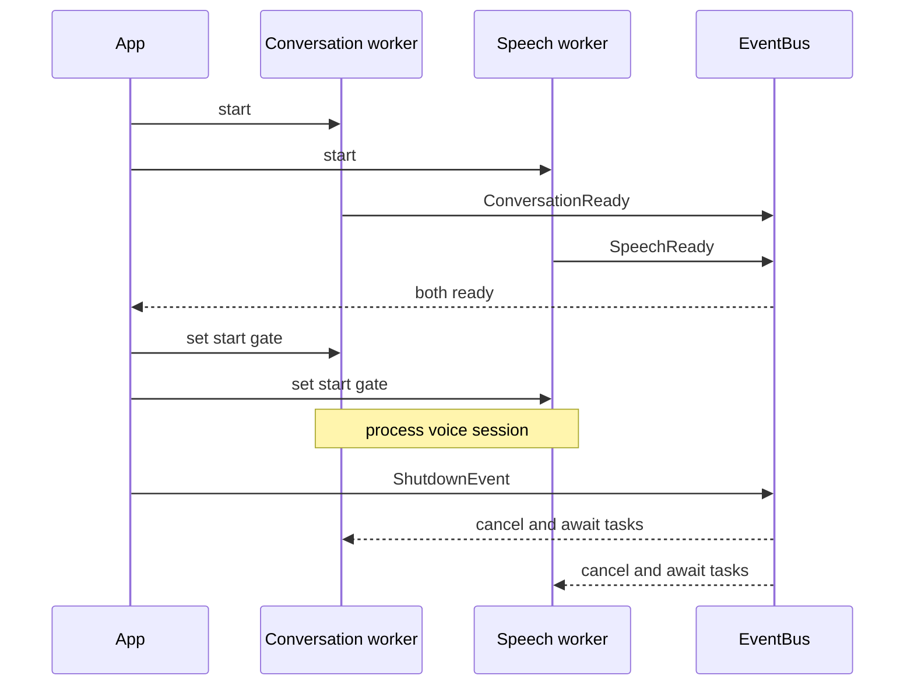
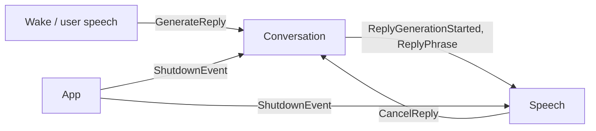

# Lifecycle and concurrency

`helomi.app` creates one `EventBus`, starts the conversation and speech workers,
waits for both readiness events, and only then releases their start gate. This
prevents an early publication from being missed by an unsubscribed worker.

The EventBus carries typed events across package boundaries. It does not make
ownership implicit: speech still owns capture/playback, conversation still owns
graph execution, and the application runtime still owns composition and shutdown.

Each long-running loop makes queue completion explicit. Every successful
`get()` has one `task_done()` in a `finally` block, including error and
cancellation paths. Resources that can block—audio devices, native processes,
model runtimes, and workers—have a single owner and deterministic teardown.

