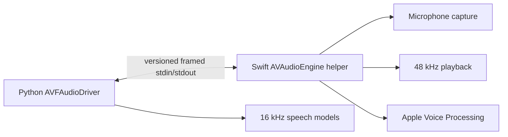

# Native macOS audio

The default `avfaudio` adapter starts a single Swift helper process that owns
`AVAudioEngine`, microphone capture, playback, Apple Voice Processing, and
playback interruption. Python owns model-format resampling and the speech
worker's policy.



Protocol version 3 carries a handshake, Float32 audio frames, play/stop/shutdown
requests, gain duck/restore requests, playback outcomes, diagnostics, and
selected-device information. The binary protocol is jointly owned by Swift and
Python. A protocol change must update the helper, Python adapter, fake helper,
Swift tests, Python tests, and the version together.

Build and validate the helper from the repository root:

```bash
swift format lint --recursive native/macos/audio
swift test --package-path native/macos/audio
native/macos/build.sh
```

See the [native package README](../../native/macos/audio/README.md) for its
focused protocol overview.
