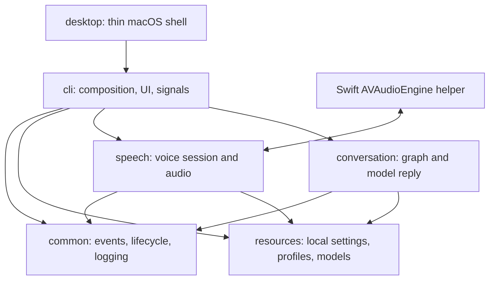

# Architecture overview

Helomi separates runtime composition, local resources, voice behavior, and
conversation behavior. The dependency direction is toward package-owned
contracts, not toward the terminal UI.

| Package | Responsibility |
| --- | --- |
| `common` | Reusable lifecycle, events, logging, and validation primitives. |
| `resources` | `HELOMI_HOME` resolution, local settings/profiles, model-path discovery, and boundary validation. |
| `speech` | Audio capture, VAD, wake word, segmentation, STT, TTS, playback, voice-session state, and adapters. |
| `conversation` | Finite graph runs, history, profiles, language-model adapters, and streamed reply segmentation. |
| `cli` | Startup, readiness, signals, shutdown, terminal UI, and composition. |
| `desktop` | Thin macOS entrypoint only. |

The [voice pipeline](voice-pipeline.md) and [conversation guide](conversation.md)
describe the two workers. [Lifecycle and concurrency](lifecycle-and-concurrency.md)
documents their shared event and shutdown contracts.
