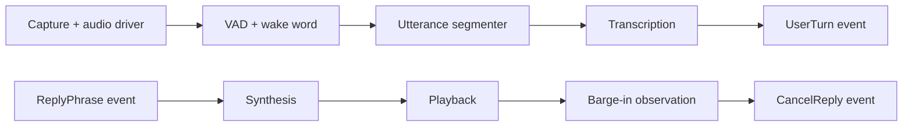

# Voice pipeline

The speech worker owns real-time voice-session policy. It opens capture,
transcription, synthesis, and playback resources once, subscribes to reply and
shutdown events, then starts worker loops after runtime readiness.

The model-facing capture stream is mono 16 kHz audio in 512-sample frames. The
native helper captures and plays at device-oriented formats; Python resamples
for models. VAD and wake-word detection operate on capture frames, segmentation
collects speech into turns, and STT commits text to the conversation worker.

Replies flow back as short text phrases. Synthesized frames and phrase boundaries
are queued for playback, allowing the first spoken phrase to start before the
whole reply completes. See [native audio](native-audio.md) for the default
full-duplex driver.
