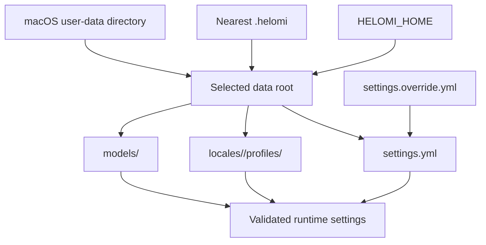

# Configuration

Helomi separates technical runtime selections from profile-specific behavior.
Settings choose adapters and shared tuning; profiles choose persona content and
adapter-compatible model parameters.

## Data-root resolution

At runtime, `LocalStore` resolves the data root in this order:

1. `HELOMI_HOME`, when set;
2. the nearest `.helomi` directory in the current directory or an ancestor;
3. the macOS user-data directory for `Helomi`.

The installer defaults to `<repository>/.helomi`, unless `HELOMI_HOME` is set.
Its copied defaults never replace existing destination files.

```text
<data-root>/
├── settings.yml
├── settings.override.yml        # optional local override
├── locales/
│   └── <language>/
│       ├── settings.yml
│       ├── settings.override.yml # optional local override
│       └── profiles/<profile-id>/
│           ├── profile.yml
│           ├── prompts/{system,opening,summary}.md
│           └── reactions/{wake,wait,background,quit}.txt
├── models/
│   ├── embedding_model.onnx
│   ├── melspectrogram.onnx
│   ├── silero_vad.onnx
│   └── <wake-word-model>.onnx
```

Settings are deep-merged in this order: root `settings.yml`, optional root
`settings.override.yml`, locale `settings.yml`, then optional locale
`settings.override.yml`. Locale settings must not define `language`; select it
in root settings or with `--language`. Keep override files local when they
contain machine-specific model choices or endpoints.



## Settings

The supplied settings are in `.helomi/settings.yml`:

```yaml
language: en-US
profiles:
  default: alexa
  selected: null

conversation:
  language_model:
    adapter: mlx
  acknowledgement_delay: 0.8

speech:
  audio:
    driver: avfaudio
  vad:
    adapter: mlx:silero_vad
    threshold: 0.5
  wakeword:
    adapter: openwakeword
  turn_taking:
    sustained_barge_in_frames: 20
    continuation_silence_frames: 38
  tts:
    adapter: piper
    repo_id: rhasspy/piper-voices
    normalize_audio: true
    volume: 1.0
  stt:
    adapter: mlx:parakeet-tdt
    model_id: mlx-community/parakeet-tdt-0.6b-v3
```

| Area | Settings contract |
| --- | --- |
| `language` | Locale directory id, defaulting to `en-US`. |
| `profiles.default` | Optional locale-local profile directory id. |
| `profiles.selected` | Explicit locale-local startup profile. CLI `--profile` overrides it for one run; an unavailable explicit profile fails startup rather than falling back. |
| `conversation.language_model` | `mlx`, or `langchain` with `base_url`. |
| `conversation.acknowledgement_delay` | Non-negative seconds from reply planning before one prepared wait reaction may play. |
| `conversation` classifier | Alexa requires the configured local `classifier` model role for ambiguous turns. |
| `speech.audio.driver` | `avfaudio` or `pyaudio`. |
| `speech.vad.adapter` | `mlx:silero_vad` or `openwakeword`; `threshold` controls speech detection. |
| `speech.wakeword.adapter` | Currently `openwakeword`. |
| `speech.segmentation` | Positive frame-based endpointing limits; see below. |
| `speech.turn_taking` | Positive frame limits for sustained barge-in and incomplete-turn continuation. |
| `speech.stt` | `mlx:parakeet-tdt`, `mlx:qwen3-asr`, or `mlx:whisper`. |
| `speech.tts` | `piper` or `mlx:chatterbox`. |

The capture stream uses 512-sample, mono, 16 kHz frames, so a frame represents
32 milliseconds. The supplied segmentation values require ten consecutive
speech frames to start, end an established utterance after 18 silent frames,
and cap a turn at 1,875 frames (60 seconds). A short utterance has a longer
trailing-silence threshold. `short_utterance_end_silence_frames` must be at
least `max_end_silence_frames`, and the maximum utterance must exceed the short
utterance threshold.

## Adapter-specific fields

The `adapter` discriminator selects the accepted settings. Do not put fields
from one adapter into another adapter's configuration.

| Stage | Adapter | Settings | Profile override |
| --- | --- | --- | --- |
| Conversation | `mlx` | adapter only | `model_id`, `max_tokens`, `temperature`, `top_p`, `top_k`, `thinking` per role |
| Conversation | `langchain` | `base_url` | `model_id`, `max_tokens`, `temperature`, `top_p`, `thinking` per role |
| STT | `mlx:parakeet-tdt` / `mlx:qwen3-asr` | `model_id`, optional `language` | optional `model_id` |
| STT | `mlx:whisper` | `model_id` | optional `model_id`, `language` |
| TTS | `piper` | `repo_id`, `normalize_audio`, `volume` | `model_path`, optional repository and voice tuning |
| TTS | `mlx:chatterbox` | `model_id`, `lang_code` | optional `model_id`, `lang_code` |

For an MLX profile, define `fast`, `detailed`, and `classifier` conversation
roles. Roles using the same model identifier can share the underlying loaded
runtime. A LangChain adapter can point at an Ollama-compatible endpoint, but
doing so may no longer be private or offline.

## Model installation

`make init` downloads the active default profile's dependencies: OpenWakeWord
assets, the selected VAD and STT repositories, required conversation models,
and either Piper files plus their `.onnx.json` companion or the selected
Chatterbox repository. It does not prepare every possible profile or adapter.

After changing a profile, install missing assets deliberately and check their
licenses. A missing model path or incompatible profile is reported during
profile inspection or startup.

See [Profiles](profiles.md) for the fixed file contract and
[Privacy and models](privacy-and-models.md) for licensing boundaries.
