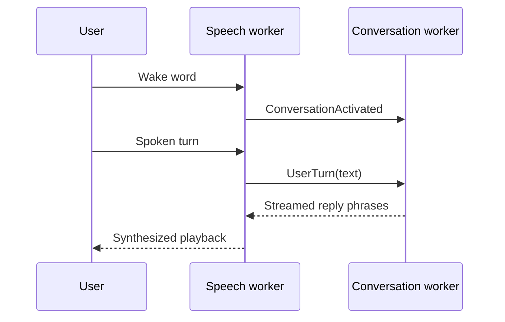

# Using Helomi

## Profiles

Helomi discovers profiles below `<data-root>/locales/<language>/profiles`. The terminal UI lists
invalid profiles too, together with the validation error, so a broken local
profile does not hide the rest. The configured `profiles.default` is selected by
default when it is valid.

The menu-bar frontend lists the same profiles under **Profiles**. Choosing a
valid profile starts it; invalid entries remain visible but disabled. The menu
shows startup progress and failures, offers retry after a failed start, and
shuts down through **Quit Helomi** or an explicit spoken request to close the
application.

**Conversation History…** shows the current run's live in-memory transcript
with listening, thinking, speaking, delivered, and interrupted reply markers.
**System Info…** groups live signals, runtime configuration, startup/download
progress, and interaction timings. Both native windows open centered the first
time and keep their user-chosen position until Helomi exits. The menu bar and
window headers use emoji to distinguish application lifecycle and agent activity
without adding decoration to technical telemetry. **Open Profile Data Folder**
opens the active profile's `data/` directory when it exists.

Each profile supplies the assistant identity, prompts, wake-word label and ONNX
model path, conversation model roles, and speech-model overrides. See
[Profiles](profiles.md) before editing one.

## Voice turn

The wake word starts an interaction. Speech is segmented, transcribed, and
committed as a user turn. The conversation worker streams text; the speech
worker separates phrases, synthesizes them, and starts playback before the full
reply has necessarily completed.

## Interrupting a reply

During playback, detected speech can duck playback and trigger barge-in. The
speech worker cancels the active reply and tells the conversation worker exactly
which spoken prefix was delivered. The next response therefore does not assume
that the user heard the unplayed remainder.

This behavior depends on actual microphone/speaker conditions. The default
native driver uses Apple Voice Processing; the PyAudio fallback does not provide
the same speaker-reference echo cancellation.
